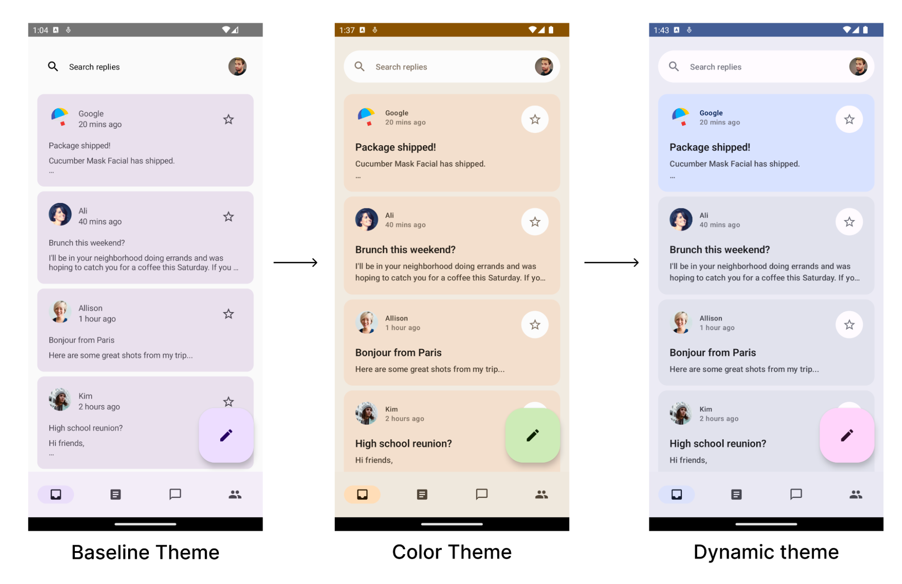

# Theming in Compose with Material 3 Codelab

This folder contains the source code for
the [Theming in Compose with Material 3 Codelab](https://developer.android.com/codelabs/jetpack-compose-theming)

## Screenshots

**_This figure is not real representative of the application's user interface. It is similar though..._**

## License

No license. I am the owner now.
